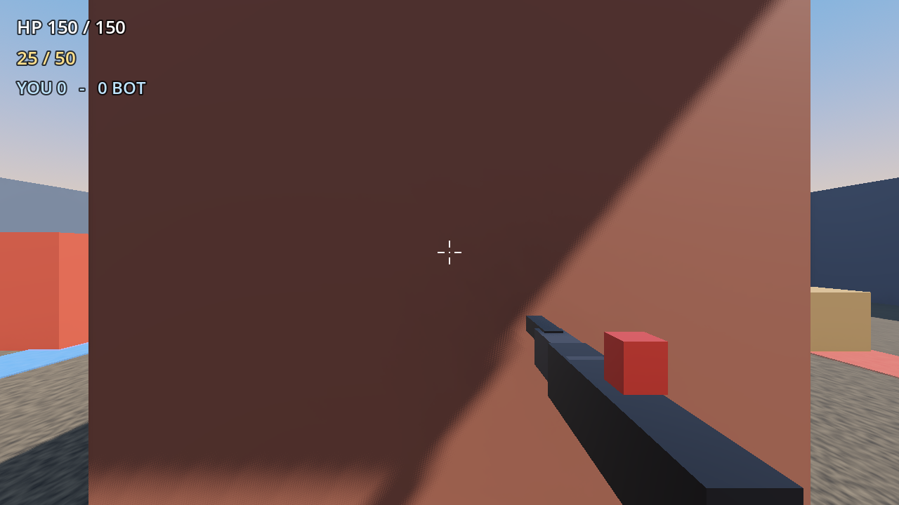
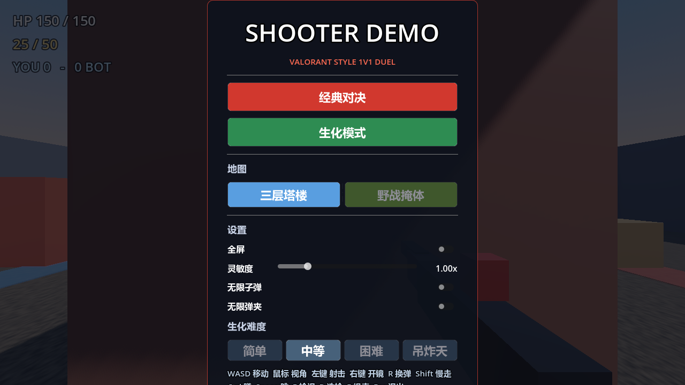
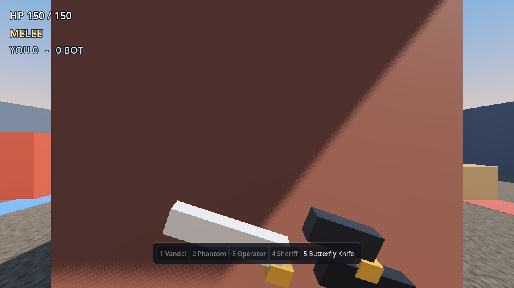
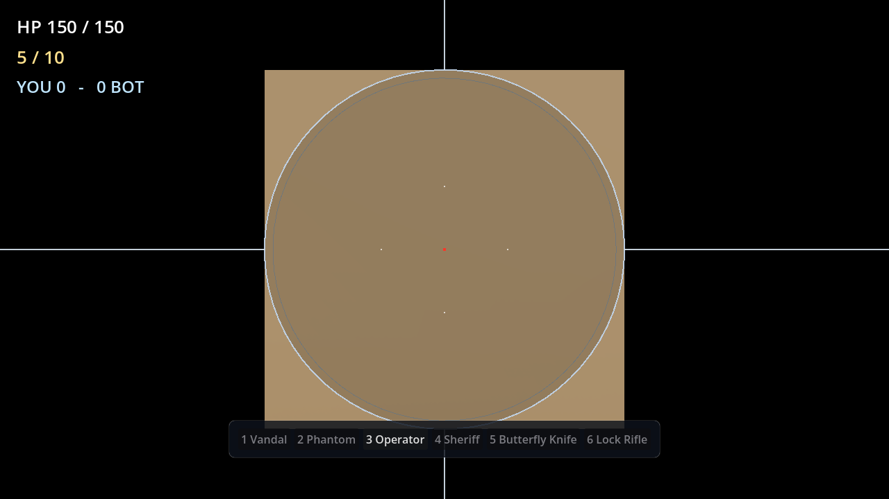
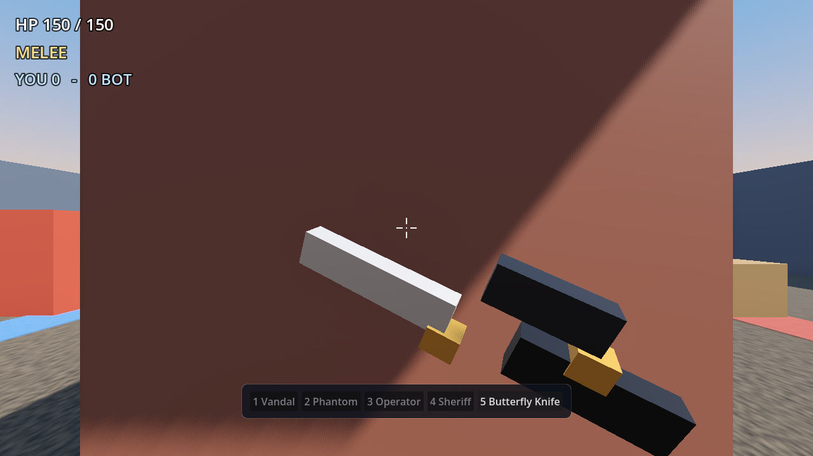
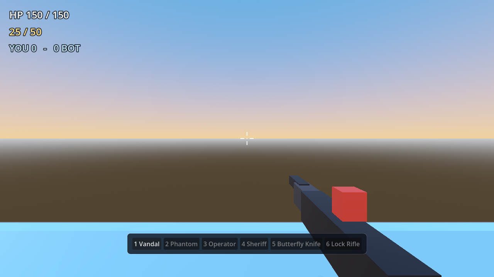
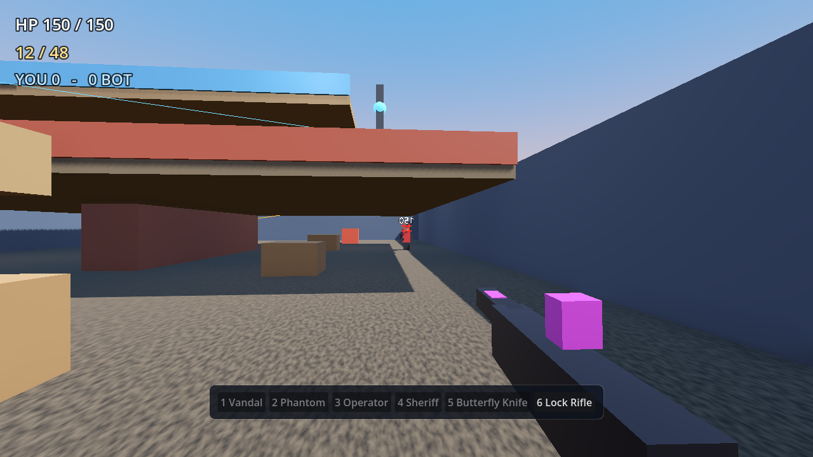

# Valorant Duel 3D

A small Godot 4 3D first-person duel game with movement and weapon values tuned
to current Valorant Vandal parameters. The map is a compact two-lane duel arena
in the style of the Valorant "Duel" maps.

## How to run

1. Open the project in Godot 4.x.
2. Run the main scene `res://scenes/main.tscn`.
3. The game starts immediately against one AI duel bot. First to 10 kills wins.

The project opens on a main menu with fullscreen, mouse sensitivity, and quit
settings. Press `Esc` in-game to exit.

## Controls

- `WASD`: move
- `Mouse`: look
- `LMB`: fire
- `RMB`: aim down sights
- `R`: reload
- `Shift`: slow walk
- `Ctrl`: crouch
- `Space`: jump
- `1-5`: switch weapon
- `6`: Lock Rifle
- `B`: open in-game weapon loadout
- `F`: inspect weapon
- `E`: use rope teleporter
- Knife `LMB`: slash with swing and retract animation
- Knife `RMB`: heavy stab
- Operator `RMB`: toggle sniper scope
- `Esc`: exit game

## Weapons

- `1` Vandal
- `2` Phantom
- `3` Operator
- `4` Sheriff
- `5` Butterfly Knife
- `6` Lock Rifle

Each weapon has its own ammo, fire rate, reload time, ADS zoom, and damage
profile. Press `F` to inspect the equipped weapon. The Butterfly Knife has
slash, heavy stab, and spin-inspect animations. The Operator uses a full-screen
scope overlay while scoped, with a transparent lens that shows the real scene.
The Lock Rifle auto-locks onto an enemy head,
disables mouse look while equipped, and keeps the crosshair on the target.

## Valorant-aligned values

- Movement: walk `5.4 m/s`, slow walk `4.5 m/s`, crouch `4.1 m/s`
- ADS movement: `4.104 m/s`, zoom `1.25x`, ADS fire rate `8.775 rds/s`
- Vandal damage: head `160`, body `40`, legs `34` at all ranges
- Vandal fire rate: `9.75 rds/s`
- Magazine: `25`, reserve: `50`, reload: `2.5 s`
- Player/bot health: `150` (100 HP + heavy shield)
- Headshot multiplier `4x`, leg multiplier `0.85x`
- Spread: standing `0.25`, crouched `0.21`, ADS `0.157`; movement penalties
  for crouch/walk/run/air are `0.8 / 3 / 6 / 10` degrees
- Gun recovery time: `0.375 s`

## Map

- Arena: `44 x 28 m`, symmetric duel layout
- Two outside lanes split by a central wall
- Low crates, tall stacks, and spawn-area blocks for basic peeking
- Bot patrols both lanes and shoots with burst fire when it has line of sight
- Procedural sounds for gunfire, reload, hitmarkers, player damage, and footsteps
- Reload animation with magazine swap and a HUD reload progress bar
- Downed death animation followed by a persistent tombstone for each player
- In-game weapon loadout panel with clickable weapon buttons
- Three-layer tower map with ramps, jump pads, rope teleporters, and angled cover
- Stronger jump for clearing low crates and stepping up between floors
- Lock Rifle with auto head-lock and locked-on crosshair brackets

The map and AI are generated at runtime from GDScript, so the repository only
needs the scene and script files.
